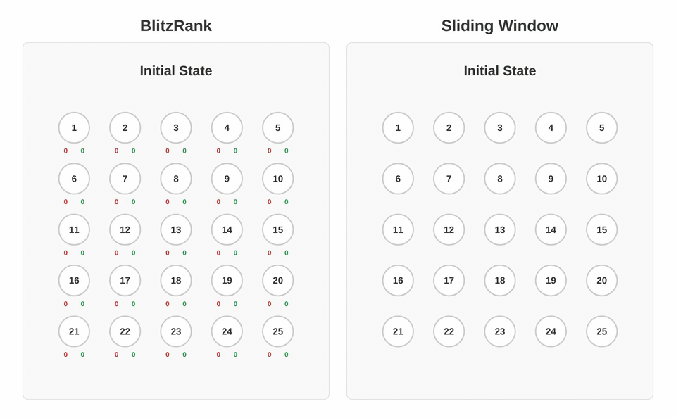

<h1 align="center">BlitzRank</h1>

<p align="center"><b>Principled Zero-shot Ranking Agents with Tournament Graphs</b></p>

<p align="center">
  <a href="https://arxiv.org/abs/2602.05448"></a>
  <a href="https://blitzrank.ai"></a>
  <a href="LICENSE"></a>
</p>

BlitzRank uses tournament graphs to extract maximal information from each LLM call, a principled framework achieving Pareto optimality across 14 benchmarks and 5 LLMs with 25–40% fewer queries.

<p align="center">
  
  <br>
  <em><strong>Algorithm visualization</strong> on the <a href="https://books.google.com/books?id=RosxmAYFFosC">25 horses puzzle</a>: find the 3 fastest horses from 25, racing 5 at a time.<br>BlitzRank converges in <strong>7 rounds</strong> vs Sliding Window's <strong>11 rounds</strong>.</em>
</p>

## Installation

```bash
uv pip install blitzrank
```

From source:

```bash
git clone https://github.com/ContextualAI/BlitzRank.git
cd BlitzRank
uv pip install -e .
```

Install with additional dependencies for baselines (AcuRank, TourRank):

```bash
uv pip install "blitzrank[all]"
# or from source:
uv pip install -e ".[all]"
```

## Quick Start

```python
from blitzrank import BlitzRank, rank

ranker = BlitzRank()

query = "capital of France"
docs = [
    "Berlin is the capital of Germany.",
    "Paris is the capital of France.",
    "Tokyo is the capital of Japan.",
]

# Any LiteLLM-compatible model works — just set the appropriate API keys as env variables
indices = rank(ranker, model="openai/gpt-4.1", query=query, docs=docs, topk=2)  # [1, 0]
top_docs = [docs[i] for i in indices]
```

## Evaluate on a Benchmark

```python
from blitzrank import BlitzRank, evaluate

ranker = BlitzRank()
rankings, metrics = evaluate(ranker, dataset="msmarco/dl19/bm25", model="openai/gpt-4.1")

print(metrics)   # {"ndcg@10": 0.72, "map@10": 0.51}
print(rankings)  # [{"query": "...", "ranking": [3, 0, 7, ...]}, ...]
```

Dataset names follow the format `collection/split/retriever`.

| Category | Datasets |
|----------|----------|
| **MSMARCO** | `msmarco/dl19/bm25`, `msmarco/dl20/bm25`, `msmarco/dl21/bm25`, `msmarco/dl22/bm25`, `msmarco/dl23/bm25`, `msmarco/dlhard/bm25` |
| **BEIR** | `beir/nfcorpus/bm25`, `beir/fiqa/bm25`, `beir/trec-covid/bm25`, `beir/nq/bm25`, `beir/hotpotqa/bm25`, `beir/scifact/bm25`, `beir/arguana/bm25`, `beir/quora/bm25`, `beir/scidocs/bm25`, `beir/fever/bm25`, `beir/climate-fever/bm25`, `beir/dbpedia-entity/bm25`, `beir/robust04/bm25`, `beir/signal1m/bm25`, `beir/trec-news/bm25`, `beir/webis-touche2020/bm25` |
| **BRIGHT** | `bright/aops/infx`, `bright/biology/infx`, `bright/leetcode/infx`, `bright/stackoverflow/infx`, ... |

## Baselines

All methods share the same interface. Create a ranker (with optional parameters), pass the model to `rank`/`evaluate`.

```python
from blitzrank import BlitzRank, SlidingWindow, SetWise, PairWise, TourRank, AcuRank, rank

query = "capital of France"
docs = ["Berlin is in Germany", "Paris is in France", "Tokyo is in Japan"]

for Method in [BlitzRank, SlidingWindow, SetWise, PairWise, TourRank, AcuRank]:
    indices = rank(Method(), model="openai/gpt-4.1", query=query, docs=docs, topk=2)
```

| Method | Description |
|--------|-------------|
| `BlitzRank` | Tournament graphs with transitive closure (ours) |
| `SlidingWindow` | RankGPT-style sliding window |
| `SetWise` | Pick-the-winner with heapsort/bubblesort |
| `PairWise` | Pairwise comparisons with heapsort/bubblesort |
| `TourRank` | Multi-round tournament filtering |
| `AcuRank` | Adaptive uncertainty-based ranking |

📖 [Full parameter reference →](docs/parameters.md)

## Reproducing Paper Results

Run all methods across all datasets and models from the paper:

```python
from blitzrank import BlitzRank, SlidingWindow, SetWise, PairWise, evaluate

DATASETS = [
    "msmarco/dl19/bm25", "msmarco/dl20/bm25", "msmarco/dl21/bm25",
    "beir/nfcorpus/bm25", "beir/trec-covid/bm25", "beir/fiqa/bm25",
]
MODELS = [
    "openai/gpt-4.1",
    "vertex_ai/gemini-3-flash-preview",
    "openrouter/deepseek/deepseek-v3.2",
    "openrouter/qwen/qwen3-235b-a22b-2507",
    "openrouter/z-ai/glm-4.7",
]
RANKERS = {
    "blitzrank": BlitzRank(),
    "sliding_window": SlidingWindow(),
    "setwise": SetWise(),
    "pairwise": PairWise(),
}

for dataset in DATASETS:
    for model in MODELS:
        for name, ranker in RANKERS.items():
            rankings, metrics = evaluate(ranker, dataset=dataset, model=model)
            print(f"{dataset}/{model}/{name}: {metrics}")
```

📖 [Custom datasets and methods →](docs/extending.md)

## Acknowledgements

This project builds upon the following open-source repositories: [RankGPT](https://github.com/sunnweiwei/RankGPT), [SetWise](https://github.com/ielab/llm-rankers), [AcuRank](https://github.com/soyoung97/AcuRank), [Pyserini](https://github.com/castorini/pyserini), and [LiteLLM](https://github.com/BerriAI/litellm).

## Citation

```bibtex
@article{blitzrank2026,
  title={BlitzRank: Principled Zero-shot Ranking Agents with Tournament Graphs},
  author={Agrawal, Sheshansh and Nguyen, Thien Hang and Kiela, Douwe},
  journal={arXiv preprint arXiv:2602.05448},
  year={2026}
}
```
